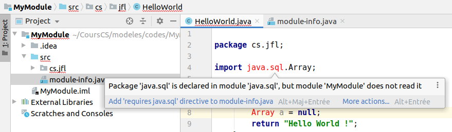
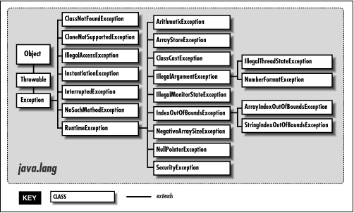

===========
POO et Java
===========

.. |year| date:: %Y

.. sectnum::
   :depth: 1

.. |date| date:: %B %Y

**Jean-Francois Lalande** - |date| - Version 2

Ce cours traite des concepts de la programmation objets, illustrés principalement avec le langage Java, et parfois en Python.

.. include:: licence

.. BREAKING and CHANGING TEMPLATE
.. raw:: pdf

   PageBreak normalPage

----

Plan
====

.. contents:: Plan du module
   :depth: 1

----

Historique et syntaxe
=====================

.. contents::
   :local:
   :depth: 1

----

Bref historique
---------------

- JDK 1.0 - 1996 - Init
- JDK 1.1 - 1997 - Reflection, JDBC, Inner classes
- JDK 1.2 - 1998 - Collection, JIT
- J2SE 1.3 - 2000 - Java sound, JNDI, JPDA
- J2SE 1.4 - 2002 - Assert, regex, exception chaining, parser XML, XSLT
- J2SE 5 - 2004 - Generics, autoboxing, enums, varargs, for (x : X)
- Java SE 6 - 2006 - 
- Java SE 7 - 2011 - Java NIO
- Java SE 8 - 2014 - Lambdas
- Java SE 9 - 2015 - Modules, JSON, HTTP/2
- Java SE 10 - 2018 - compilateur JIT Graal
- Java SE 11 - 2018 - 
- Java SE 12 - 2019 - Shenandoah: un ramasse miette à courtes pauses

----

La syntaxe en 3 minutes
-----------------------

----

Programmation orientée objet
============================

.. contents::
   :local:
   :depth: 1

----

Les concepts de la POO
----------------------

Organisation du code pour atteindre de nouveaux objectifs:

- proche d'une réalité métier
- favoriser la réutilisabilité du code
- favoriser la conception

Basée sur quatre grands principes:

- l'encapsulation 
- le masquage des données
- la composition
- le polymorphisme

----

L'objet
-------

L'objet met en oeuvre le principe d'**encapsulation** et étend le concept de variable des langages non objets.

**Encapsulation**: regrouper et masquer les données et programmes relatifs à un objet vis-à-vis des autres objets.

L'objet contient:

- des attributs typés (des variables)
- des méthodes (du code)

En UML, on représente l'objet ainsi:

.. image:: images/objet.png
   :width: 30%

D'un point de vue d'un programme qui s'exécute, un objet occupe une zone mémoire pour stocker ses attributs, et ses méthodes.

----

La classe
---------

La **classe** est le modèle ou patron, qui permet de créer un objet.

En UML, on représente la classe ainsi:

Un objet est **une instance** de classe.

Conséquement:
- une classe contient des noms d'attributs mais pas de valeurs d'attributs
- une classe contient le code des méthodes
- l'objet peut se passer du code des méthodes

----

Et en Java ?
~~~~~~~~~~~~

Définition de la classe Vehicule:

.. include:: codes/POO2/src/Vehicule.java
   :code: java

Instanciation depuis le programme "main": 

.. include:: codes/POO2/src/Main.java
   :code: java

----

Et en Python ?
~~~~~~~~~~~~~~

C'est un peu le bordel_:

.. _bordel: https://stackoverflow.com/questions/27481116/how-to-declare-a-static-attribute-in-python

.. include:: codes/POO2/vehicule.py
   :code: python

.. code-block:: bash

  Vehicule.marque: Peugeot
  v.marque: Peugeot -- WTF?
  v2.marque: Toyota
  v.marque: Peugeot

**Solution**: utiliser *self* et un *constructeur* (cf. plus tard)

----

Soi-même: this et self
----------------------

Puisque on souhaite mettre en oeuvre l'encapsulation, c'est-à-dire distinguer ce qui est dans l'objet et extérieur à l'objet, les langages définissent un mot du langage désignant l'objet contenant le code qui s'exécute:

En Java: this

.. code-block:: java

  public class Vehicule {
    public int vitesse;
    public int demarrer() { 
      this.vitesse = 0;
      return this.vitesse; }
  }

En Python: self

.. code-block:: python

  class Vehicule:
    demarrer():
      self.vitesse = 0

----

Le constructeur
---------------

Il s'agit de la méthode appelée lors de l'instanciation d'un objet. Son rôle est de:

- d'initialiser les attributs
- de réaliser des actions obligatoires rendant l'objet viable

En général on a trois grand types de constructeurs:

- le constructeur par défaut (sans paramètre)
- le constructeur par recopie_ (1 paramètre du même type)
- les constructeurs avec des tas de paramètres

.. _recopie: https://www.journaldev.com/21078/copy-constructor-in-java

----

Et en Java ?
~~~~~~~~~~~~

.. include:: codes/Constructeurs/src/Vehicule.java
   :code: java

----

Et en Python ?
~~~~~~~~~~~~~~

Pas de surcharge des constructeurs:

.. include:: codes/Constructeurs/vehicule.py
   :code: python

Output:

.. code-block:: python

   v2.marque: Toyota
   v3.marque: Nissan

----

Retour sur le principe d'encapsulation
~~~~~~~~~~~~~~~~~~~~~~~~~~~~~~~~~~~~~~

Encapsuler les données et le code permet d'améliorer la qualité du code, sa réutilisabilité et d'aider le prochain développeur dans sa compréhension de ce code.

Le but premier_ de l'encapsulation est de **grouper** le code et les données dans une même classe pour éviter l'éparpillement du code qui traite ces données.

.. _premier: https://stackoverflow.com/questions/28612420/what-is-encapsulation-exactly

Cependant, l'encapsulation n'empêche nullement d'accèder aux données. On peut donc par inadvertance les modifier à loisir depuis l'extérieur de la classe. Pour éviter cela, on cherche donc à:

- masquer les données à ne pas exposer à ce risque
- exposer les données que chacun peut lire/écrire

On parle de **visibilité** et de **masquage** de données.

----

Visibilité et masquage des données
----------------------------------

Certains langages proposent de définir une sorte de **contrôle d'accès aux données** de l'objet. Cela permet de:

- se poser des questions sur la visibilité des attributs et méthodes
- se poser des questions sur le code:

  - mécanique interne à l'objet ou pas ?
  - actions légitimes de l'utilisateur de l'objet ?

----

La visibilité des attributs
~~~~~~~~~~~~~~~~~~~~~~~~~~~

Les langages orientés objets proposent généralement au moins deux niveaux de visibilité des attributs:

- **public**: tout code peut y avoir accès
- **private**: seule le code de classe a un accès

On trouve aussi la notion de visibilité "package", "module" et "amie":

- **package** / **module**: une classe du même package, module a un accès
- **protected**: les sous-classes peuvent y avoir accès
- **amie**: une classe déclarée amie a un accès
- **published**: visible par tous et à conserver tel quel dans le futur

----

Et en Java ?
~~~~~~~~~~~~

- **private**: non visible classes
- **protected**: comme public pour l'instant (cf. section héritage)
- **public**: visible pour tous

.. image:: images/visibility1.png
   :width: 90%

cf `answer of aioobe about What is the difference between public, protected, package-private and private in Java? <https://stackoverflow.com/a/33627846/1156363>`__

----

La visibilité des méthodes Java
~~~~~~~~~~~~~~~~~~~~~~~~~~~~~~~

Elle est identique aux règles de visibilité des attributs en Java.

.. code-block:: java

  public class Machin {

    public void f();

    private void g();
  
  }

  public class Truc {

    public void h() {
      Machin m = new Machin();
      m.f();
    }
  }

----

Et en Python ?
~~~~~~~~~~~~~~

Les méthodes et attributs privées existent et son préfixés par un double underscore. Cependant, il n'y a pas de garantie du langage car on peut contourner la visibilité par introspection...

Par exemple, le programme suivant:

.. include:: codes/pypriv.py
   :code: java

écrit en console:

.. code-block:: bash

  10
  15

----

La composition
--------------

La composition permet de définir un lien entre deux classes. Il y a un lien fort entre les deux objets composés, à tel point que la destruction de l'un entraine la destruction de l'autre.

.. image:: images/compo.png
   :width: 60%

La cardinalité du composé (le moteur) est forcément de 1 maximum (pas de *  possible). Dans l'autre sens, on est libre car dans notre exemple, une voiture pourrait avoir plusieurs moteurs (une hybride par exemple).

----

Implémentation
~~~~~~~~~~~~~~

D'un point de vue de l'implémentation, on utilise tout simplement un attribut de type:

- référence simple: 0 à 1 objet composé
- collection: 0 à * objets composés

.. code-block:: java

   public class Voiture {
     private Moteur p = null;

     Moteur getMoteur() {
       return p;
     }
   }

La destruction du moteur est automatique: elle est assurée par le *garbage collector* si la voiture est détruite.

----

L'agrégation
~~~~~~~~~~~~

Une relaxation de la composition est l'agrégation: les entités sont liées mais ne s'appartiennent pas: on peut être agrégé à plusieurs classes différentes. Il n'y a pas de destruction automatique à implémenter quand on lie les objets par agrégation.

.. code-block:: java

   public class Personne {
     private Vector<Voiture> p = null;
   }

L'agrégation n'a pas de sens: on peut agréger la voiture à la personne ou dans l'autre sens. Le choix dépend de l'implémentation: quel est l'objet qui sera manipulé à un plus haut niveau. Eventuellement, on peut agréger dans les deux sens, mais la cohérence de l'ensemble est plus difficile à maintenir: à éviter.

----

Et en python ?
~~~~~~~~~~~~~~

Les concepts sont les mêmes, et on utilise des attributs de classe:

.. include:: codes/pycompo.py
   :code: python

----

Généralisation et spécialisation
--------------------------------

La généralisation et spécialisation de classe sont des mécanismes importants des langages orientés objets. Cela sert principalement à:

- factoriser du code dégagé de comportements généraux
- forcer l'implémentation de comportement spécifiques

D'un point de vue implémentatoire, on utilie l'héritage pour lier deux classes entre elle et on dit que "A hérite de B" ou bien que "A est un B".

.. image:: images/heritage.png
   :width: 20%

----

L'héritage multiple
~~~~~~~~~~~~~~~~~~~

Une classe peut éventuellement hériter de plusieurs classes: c'est l'héritage multiple. Supporté dans certains langages de programmation, ce n'est pas permis dans d'autres.

.. image:: images/heritagem.png
   :width: 40%

Notamment, cela pose des problèmes de:

- chainage d'appels dans les classes parentes (plusieurs chemins possibles)
- chainage des constructeurs
- cast

----

Et donc en python ?
~~~~~~~~~~~~~~~~~~~

La résolution des méthodes en collision (constructeur_ compris) se fait de gauche à droite lors de l'héritage multiple: 

.. _constructeur: https://stackoverflow.com/questions/3277367/how-does-pythons-super-work-with-multiple-inheritance

.. include:: codes/heritagem.py
   :code: python

Output: Vehicule Voiture a b

----

Et donc pour Java, nada ?
~~~~~~~~~~~~~~~~~~~~~~~~~

Nada. Afin d'éviter le problème du diamant, Java n'autorise pas l'héritage multiple. Dans le problème du diamant, la super classe définit des méthodes qui existent ensuite pour A et B, peuvent être redéfinies, mais qui entrent en conflit pour la définition de C.

.. image:: images/diamant.png
   :width: 30%

En fait, on a coutume de dire que dans Java on réalise l'héritage multiple en utilisant des *Interfaces*.

----

Interfaces
~~~~~~~~~~

Une interface définit un contrat, en général sans code, qu'il faut implémenter pour une classe qui *implements* cette interface. 

.. include:: codes/Heritage/src/Contrat1.java
   :code: java

.. include:: codes/Heritage/src/Contrat2.java
   :code: java

.. include:: codes/Heritage/src/Test.java
   :code: java

Pas de collision possible ici: on respecte le contrat et il n'y a pas de chainage d'appel à faire.

----

Oui mais...
~~~~~~~~~~~

Dans Java 8, on peut mettre du code dans les interfaces (à l'aide du mot clef *default*) ! Diable !

Il n'y a pas de problème pour la signature de la méthode, mais plutôt pour appeler l'implémentation faite dans l'interface depuis la classe. La solution est de nommer l'interface avant le mot clef *super*.

.. include:: codes/Heritage/src/Contrat1J8.java
   :code: java

.. include:: codes/Heritage/src/Contrat2J8.java
   :code: java

.. include:: codes/Heritage/src/TestJ8.java
   :code: java

----

Généralisation concrète ou abstraite
~~~~~~~~~~~~~~~~~~~~~~~~~~~~~~~~~~~~

Lorsqu'on généralise une classe par héritage, la classe parente est dite "concrète" ou "abstraite". Une classe concrète est instantiable, c'est-à-dire que créer un objet de ce type a un sens pour le modèle. Une classe abstraite est une classe dont on ne pourra jamais faire d'instance. Dans les exemples précédents, Vehicule aurait dû être une classe abstraite, car on ne peut pas construire de véhicule de type Vehicule.

.. include:: codes/Heritage/src/AVehicule.java
   :code: java

.. include:: codes/Heritage/src/Voiture.java
   :code: java

----

Extension et restriction
~~~~~~~~~~~~~~~~~~~~~~~~

Lorsqu'on réalise un héritage, on souhaite factoriser du code (généralisation). Mais parfois, on souhaite spécialiser la classe, lui ajouter un comportement particulier: on parle d'**extension**. Cela signifie:

- ajouter des attributs
- ajouter des méthodes
- changer l'implémentation de la méthode parente

Parfois, on souhaite faire l'inverse: restreindre les capacités d'une classe, car dans la classe fille, ces capacités n'ont plus de sens: on parle de **restriction**. En général, c'est à éviter mais cela peut avoir un sens: une méthode restreinte peut par exemple ne plus être valide dans la classe fille: on peut par exemple y lever une exception. Par exemple, si on a une classe Forme avec une méthode tourner(), on peut dire que cette méthode n'est plus utile pour Cercle.

----

Bilan
~~~~~

- héritage d'une classe

  - pas d'héritage multiple
  - la méthode héritée n'est pas à réécrire

- implémentation d'une interface

  - implémentation multiple: pas de collision de méthodes
  - la méthode implémentée est à réécrire même si une implémentation existe dans l'interface

- généralisation

  - classe parente abstraite ou concrête
  - par extension ou restriction

----

Polymorphisme
-------------

Le polymorphisme (poly morph) est la capacité d'un langage à considérer un objet sous plusieurs formes et d'agir en conséquence, notamment lors d'appels de méthodes. Cela est rendu possible par la notion d'héritage. La relation "est un" permet à un objet d'être à la fois son type, ou le type d'une classe parente, voire d'une inteface.

Pour rendre l'objet polymorphe, on parle:

- du *cast* d'un objet: (Type) o
- de généralisation lorsqu'on *upcast*
- de spécialisation lorsqu'on *downcat*

.. code-block:: java

   Voiture vo = new Voiture();
   Vehicule ve = (Vehicule)vo; // upcast

Upcaster n'est jamais dangereux, mais à l'inverse un *downcast* peut lever une exception.

----

Polymorphisme
~~~~~~~~~~~~~

On parle de polymorphisme au *runtime* parce que la nature des objets n'est connue qu'à l'exécution. La résolution de la bonne méthode à appeler est donc effectuée à l'exécution. Par exemple, on peut écrire un algorithme utilisant des Vehicule et appelant démarrer, et à l'exécution exécuter l'algorithme sur une Voiture.

.. image:: images/polymorphisme.png
   :width: 60%

----

Polymorphisme au runtime
~~~~~~~~~~~~~~~~~~~~~~~~

Les règles suivantes s'appliquent en Java:

- Dynamic Method Dispatch: la méthode la plus spécialisée est exécutée
- Data member: on récupère la donnée du niveau considéré

.. include:: codes/Heritage/src/HeritageA.java
   :code: java

.. include:: codes/Heritage/src/HeritageB.java
   :code: java

----

.. include:: codes/Heritage/src/PolymorphismeAB.java
   :code: java

qui donne à l'exécution:

.. code-block:: bash

	b.i: 2
	b.f(): -2
	b.g(): B
	HB.g(): B
	a.i: 1
	a.f(): -2
	a.g(): A

----

Finalement
~~~~~~~~~~

Dernier point, le mot clef **final**.

Il permet de protéger l'accès à des éléments d'une classe dans le cas d'une spécialisation de celle-ci:

- méthode finale: on ne peut redéfinir cette méthode dans la classe fille
- classe finale: on ne peut hériter de cette classe

Petite confusion possible avec une variable *final*:

- une variable de type simple *final* ne peut être modifiée
- une référence *final* vers un objet ne peut être modifié

Cela n'a pas grand chose à voir avec une classe ou une méthode *final*.

----

.. include:: codes/Heritage/src/Homme.java
   :code: java

.. include:: codes/Heritage/src/SDF.java
   :code: java

----

.. include:: codes/Heritage/src/SDF2.java
   :code: java

- la modification du champs parent num_seu_social est impossible car *final*
- la méthode remplirPoches(String) est devenue *final* et donc non redéfinissable
- dans SDF, seule une affectation dans le constructeur est possible

----

La classe spéciale Object
~~~~~~~~~~~~~~~~~~~~~~~~~

En Java, toute classe hérite de Object.

- sans héritage, le *extends Object* est implicite
- avec héritage, la dernière classe parente hérite de *Object*

Les méthodes de la classe Object sont les suivantes:

.. image:: images/object_methods.png
   :width: 100%

----

Retour sur la visibilité
~~~~~~~~~~~~~~~~~~~~~~~~

----

Références
----------

Quelques liens utiles:

- https://www.uml-diagrams.org/generalization.html
- https://www.geeksforgeeks.org/java-and-multiple-inheritance/
- https://www.geeksforgeeks.org/oops-generalization-as-extension-and-restriction-using-java/
- https://www.geeksforgeeks.org/generalization-and-specialization-in-java/
- http://d.martg.pagesperso-orange.fr/la.htm

Codes source:

https://github.com/jflalande/Heritage

----

La machine virtuelle Java
=========================

.. contents::
   :local:
   :depth: 1

----

Machine virtuelle Java
----------------------

La machine virtuelle travaille sur le *bytecode*, en général obtenu à partir de fichiers sources Java. Elle interprète le *bytecode* contenu dans les .class ou .jar. Elle peut aussi les compiler à la volée (*just-in-time* compiler, JIT).
La plupart des machines virtuelles modernes peuvent interpréter ou compiler le
*bytecode*. Enfin, certains outils permettent de compiler du *bytecode* en code natif.

A la différence des langages classiques *write once, compile anywhere*, le
langage Java est du type *compile once, run anywhere*. Le code compilé, le
*bytecode* peut être exécuté indifférement sur une machine virtuelle
implémentée pour fonctionner sur Windows, Linux, Android, etc...

Liste non exhaustive de quelques machines virtuelles:

- Sun Microsystems
- GNU Compiler for the Java Programming Language
- IBM
- ...

----

Le bytecode
-----------

Le *bytecode* est une séquence d'instruction pour la machine virtuelle. La
JVM stocke pour chaque classe chargée le flot de bytecode associé à chaque
méthode.
Une méthode peut être par exemple constituée du flot ci-dessous [BB]_:

.. code-block:: text

  // Bytecode stream: 03 3b 84 00 01 1a 05 68 3b a7 ff f9
  // Disassembly:
  iconst_0      // 03
  istore_0      // 3b
  iinc 0, 1     // 84 00 01
  iload_0       // 1a
  iconst_2      // 05
  imul          // 68
  istore_0      // 3b
  goto -7       // a7 ff f9
  	
Le nombre d'*opcodes* est petit ce qui permet de faire tenir tous les
*opcodes* sur un octet.
Brièvement, voici une liste des opcodes:

- **iconst_X**: empiler la constante X sur la pile
- **iload_X**: empiler la variable locale n°X
- **istore_X**: dépiler un entier et le stocker dans la variable locale n°X
- **i2f**: convertir un int en float
- **iadd, imul, iinc...**: opérations arithmétiques
- **ireturn**: retourne le résultat

----

Example de code source et de bytecode
~~~~~~~~~~~~~~~~~~~~~~~~~~~~~~~~~~~~~

Voici un extrait tiré de [BB]_:

.. code-block:: java

  byte a = 1;
  byte b = 1;
  byte c = (byte) (a + b);
  return c;

Qui se retrouve compilé sous la forme:

.. code-block:: text

  iconst_1  // Push int constant 1.
  istore_1  // Pop into local variable 1, which is a: byte a = 1;
  iconst_1  // Push int constant 1 again.
  istore_2  // Pop into local variable 2, which is b: byte b = 1;
  iload_1   // Push a (a is already stored as an int in local variable 1).
  iload_2   // Push b (b is already stored as an int in local variable 2).
  iadd      // Perform addition. Top of stack is now (a + b), an int.
  int2byte  // Convert int result to byte (result still occupies 32 bits).
  istore_3  // Pop into local variable 3, which is byte c: byte c = (byte) (a + b);
  iload_3   // Push the value of c so it can be returned.
  ireturn   // Proudly return the result of the addition: return c;
 
----

Decompilation à l'aide de l'outil javap
~~~~~~~~~~~~~~~~~~~~~~~~~~~~~~~~~~~~~~~

.. code-block:: java

  public class Decompilation {
    int test() {
        byte a = 1;
        byte b = 1;
        byte c = (byte) (a + b);
        return c;
    }

    public static void main(String[] args) {
        Decompilation d = new Decompilation();
        int res = d.test();
        System.out.println("Out: " + res);
    }
  }
  
La décompilation peut se faire à l'aide de l'outil **javap**:

.. code-block:: bash

   javap -c -private Decompilation

- -public: Shows only public classes and members.
- -protected: Shows only protected and public classes and members.
- -package: Shows  only  package,  protected, and public classes and members. 
- -private: Shows all classes and members.

----

Exemple de décompilation
~~~~~~~~~~~~~~~~~~~~~~~~

Par exemple, le code précédent décompilé par:

.. code-block:: bash

   javap -c -public  Decompilation > Decompilation.txt

donne:

.. code-block:: java

  Compiled from "Decompilation.java"
  class Decompilation extends java.lang.Object{
  public static void main();
  Code:
   0:  new #2; //class Decompilation
   3:  dup
   4:  invokespecial #3; //Method "<init>":()V
   7:  astore_0
   8:  aload_0
   9:  invokevirtual #4; //Method test:()I
   12: istore_1
   13: getstatic #5; //Field java/lang/System.out:Ljava/io/PrintStream;
   16: new #6; //class java/lang/StringBuilder
   19: dup
   20: invokespecial #7; //Method java/lang/StringBuilder."<init>":()V
   23: ldc #8; //String Out: 
   25: invokevirtual #9; //Method java/lang/StringBuilder.append:...
   28: iload_1
   29: invokevirtual #10; //Method java/lang/StringBuilder.append:...
   32: invokevirtual #11; //Method java/lang/StringBuilder.toString:...
   35: invokevirtual #12; //Method java/io/PrintStream.println:...
   38: return
  }

----

Chargement dynamique de code
----------------------------

L'utilisation de *bytecode* intermédiaire impose de résoudre les dépendances
entre classes lors de l'exécution. Cela n'empêche pas le compilateur de
réaliser des vérifications entre classes, par exemple la présence ou non d'une
fonction appellée sur un objet de type B depuis un objet de type A.

C'est dans le **CLASSPATH** que la machine virtuelle cherche les classes
mentionnées après les directives **import**:

.. code-block:: java

  import p.Decompilation;
    public class Chargement {
        public static void main() {
            Decompilation d = new Decompilation(); }}
  
A la compilation, on obtient:

.. code-block:: text

  javac Chargement.java
  Chargement.java:1: package p does not exist
  import p.Decompilation;
          ^
  1 error

ce qui montre que le compilateur cherche **Decompilation** dans le sous
répertoire **p** du **CLASSPATH**. Si celui-ci est situé dans
**unautreendroit**, il faut mettre à jour le **CLASSPATH**:

.. code-block:: text

   export CLASSPATH=./unautreendroit:$CLASSPATH

----

Les jar
~~~~~~~

La spécification des fichiers *jar* [JS]_ décrit l'utilisation du Manifest qui
permet d'ajouter des informations pour l'utilisation du *jar*. Ce Manifest
contient:

- Des informations générales (version, date et auteur, CLASSPATH des
  ressources requises).
- La classe contenant le **main** si ce jar contient une application qui est
  lancée via l'exécution de **java -jar x.jar**.
- Des informations pour les applets embarquées dans le *jar*.
- Des informations de signature.

.. code-block:: text

  Manifest-Version: 2.0 
  Created-By: 1.O (JFL)
  Main-Class: p.Decompilation

  Name: p/Decompilation.class
  Digest_Algorithms: MD5
  MD5-Digest: base64(ae322ab9de701f1e79bc2040b26349e9)
   
On peut alors construire et exécuter un *jar* comme suit:

.. code-block:: bash

   jar cfm executable.jar Manifest.txt p/Decompilation.class
   java -jar executable.jar      
   Out: 2

----

Le CLASSPATH et les jar
~~~~~~~~~~~~~~~~~~~~~~~

Le **CLASSPATH** donne la liste des emplacements ou la machine virtuelle est
autorisée à charger des classes. S'il s'agit d'un nom de répertoire, il
désigne la racine de l'arborescence correspondante aux *packages*. Si le
**CLASSPATH** contient des fichiers *jar*, les classes sont cherchées et chargées directement depuis l'intérieur de l'archive, la racine de l'arborescence correspondant à la racine de l'archive.

L'exemple suivant permet de charger le fichier **./unautreendroit/p/Decompilation.class**, ou le fichier **p/Decompilation.class** à l'intérieur de archive.jar.

.. code-block:: text

   export CLASSPATH=./unautreendroit:./archive.jar:$CLASSPATH

La création d'un *jar* se fait à l'aide de la commande *jar*:

.. code-block:: bash

   > cd unautreendroit
   unautreendroit> jar cvf archive.jar */*.class
   manifest ajouté
   ajout : p/Decompilation.class (39% compressés)

Comme pour la commande *tar*, on peut visualiser un *jar*:

.. code-block:: bash

   jar tf archive.jar 
   META-INF/MANIFEST.MF
   p/Decompilation.class

----

Packages et modules
-------------------

Historiquement, avant Java 9, seuls les *packages* étaient disponibles pour modulariser le code d'une application. Le nom d'une classe est complet avec son nom de *package*:

.. code-block:: java

  import java.lang.String;

L'utilisation de *packages* permet de lever l'ambiguitié lors d'une collision de noms de classes. Il y a aussi une bijection entre le nom du *packages* et la hiérarchie des répertoire, que ce soit dans un *jar* ou dans vos sources:

.. code-block:: bash

   jar tf archive.jar 
   META-INF/MANIFEST.MF
   p/Decompilation.class

----

rt.jar
~~~~~~

Toujours avant Java 9, les classes de bases sont toutes embarqués dans l'archive rt.jar (~60 Mo).

.. code-block:: bash

	.
	├── com
	│   ├── oracle
	│   └── sun
	├── java
	│   ├── applet
	│   ├── awt
	│   ├── beans
	│   ├── io
	│   ├── lang
	│   ├── math
	│   ├── net
	│   ├── nio
	│   ├── rmi
	│   ├── security
	│   ├── sql
	│   ├── text
	│   ├── time
	│   └── util
	├── javax
	│   ├── accessibility
	...

----

Retour sur le chargement des classes
~~~~~~~~~~~~~~~~~~~~~~~~~~~~~~~~~~~~

Plusieurs inconvénients sont identifiés:

- charger une classe signifie qu'il faut:

  - chercher dans rt.jar
  - chercher dans le CLASSPATH

- le chargement est linéaire avec l'ensemble des .jar

  - l'une des deux classes identiques du même package sera chargée suivant l'ordre du CLASSPATH
  - les dépendances d'une classe sont chargées à leur tour

- il n'y a pas de modularité de rt.jar, qui grossit avec l'évolution du langage

En Java 9, Oracle introduit les *modules*.

----

Les modules
-----------

Les classes de base sont désormais modularisées dans des fichiers .jmod, pour un total de 191 Mo.

.. code-block:: bash

  ls /usr/lib/jvm/java-11-openjdk-amd64/jmods
  java.base.jmod            jdk.attach.jmod          jdk.jlink.jmod
  java.compiler.jmod        jdk.charsets.jmod        jdk.jshell.jmod
  java.datatransfer.jmod    jdk.compiler.jmod        jdk.jsobject.jmod
  java.desktop.jmod         jdk.crypto.cryptoki.jm   jdk.jstatd.jmod
  ...

java.base.jmod fait quand même 124 Mo...

Les jmod sont des fichiers 7z qui  contiennent les .class, comme des .jar, mais dans le sous répertoire *classes*:

.. code-block:: bash

	7z x java.sql.jmod
	tree
	.
	├── classes
	│   ├── java
	│   │   └── sql
	│   │       ├── Array.class
	│   │       ├── BatchUpdateException.class
	│   │       ├── Blob.class
	│   │       ├── CallableStatement.class
	│   │       ├── ClientInfoStatus.class
	│   │       ├── Clob.class
	│   │       ├── ConnectionBuilder.class
	...

----

Module-info
~~~~~~~~~~~

Dans un module, un descripteur spécifique nommé *module-info* va déclarer les packages qui sont
explicitement disponible pour les autres modules.

Le source de ce fichier peut par exemple être:

module mon.module {
  exports mon.module
}

ce qui expose par exemple la classe mon.module.MaClasse.

Par exemple, si l'on interroge le contenu du module java.sql, on obtient:

.. code-block:: bash

	java --describe-module java.sql
	java.sql@11.0.4
	exports java.sql
	exports javax.sql

Puisqu'on exporte des packages, on se doute qu'un autre module va importer ces packages.

----

Directives de module-info
~~~~~~~~~~~~~~~~~~~~~~~~~

Le Module-info de java.sql contient en effet plus de choses que des *exports*:

.. code-block:: bash

	java --describe-module java.sql
	java.sql@11.0.4
	exports java.sql
	exports javax.sql
	requires java.xml transitive
	requires java.base mandated
	requires java.transaction.xa transitive
	requires java.logging transitive
	uses java.sql.Driver

ce qui signifie notamment que ce module a besoin du package java.xml pour fonctionner.

Module-info path peut contenir d'autres directives:

- requires M: a besoin du module M
- requires transitive: a besoin du module M et ses dépendances
- uses X: est un consommateur du service X
- provides X: fournit une implémentation de service X
- opens PKG: autorise la reflection sur PKG

----

Construction d'un module applicatif
~~~~~~~~~~~~~~~~~~~~~~~~~~~~~~~~~~~

.. image:: images/appmodule.png
   :width: 70%

----

Construction du JAR du module applicatif
~~~~~~~~~~~~~~~~~~~~~~~~~~~~~~~~~~~~~~~~

Dans IntelliJ_, il faut générer le JAR depuis "Artifacts":

.. _IntelliJ: https://stackoverflow.com/questions/1082580

File -> Project Structure -> Project Settings -> Artifacts -> Click green plus sign -> Jar -> From modules with dependencies...

On obtient alors dans out/artifacts/MyModule_jar:

.. code-block:: bash

  MyModule.jar
  
  jar tf MyModule.jar
  cs/
  cs/jfl/
  cs/jfl/HelloWorld.class
  module-info.class

On peut explorer les dépendances de notre module avec l'outil jdep:

.. code-block:: bash

  jdeps MyModule.jar 
  MyModule
   requires mandated java.base (@11.0.4)
   requires java.sql (@11.0.4)
  MyModule -> java.base
  MyModule -> java.sql
   cs.jfl  -> java.io         java.base
   cs.jfl  -> java.lang       java.base
   cs.jfl  -> java.sql        java.sql

----

Module-path
~~~~~~~~~~~

La variable d'environnement MODULEPATH ou l'option module-path de la ligne de commande se comporte comme CLASSPATH et l'option cp:

.. code-block:: bash

  java --module-path `pwd` --module MyModule/cs.jfl.HelloWorld
  Hello World !

.. code-block:: bash

  export MODULEPATH=`pwd`
  java --module-path `pwd` --module MyModule/cs.jfl.HelloWorld
  Hello World !

Le classpath n'est pas déprécié et peut coexister avec modulepath. Les packages du classpath sont mis par défaut dans le module **unnamed module**, de manière similaire au **default package**. L'unname module peut charger tous les packages des modules et exporte tout ce qu'il contient.

----

Résolution des dépendances
~~~~~~~~~~~~~~~~~~~~~~~~~~

La JVM est en charge de la résolution des modules au lancement de l'application. Contrairement au chargement des classes au travers du classpath qui était linéaire, le chargement des modules est arborescent: chaque module comportant des directives *requires* permet à la JVM de chercher directement le module adéquat et de poursuivre le chargement récursivement.

Dans notre exemple, jdep permet de dessiner l'arbre de dépendane du module:

.. image:: images/MyModule.dot-verbose.png
   :width: 100%

----

Retour sur la visibilité
~~~~~~~~~~~~~~~~~~~~~~~~

.. image:: images/visibility.png
   :width: 90%

----

Cheat Sheet
~~~~~~~~~~~

Jrebel a édité une page A4 qui peut servir de `mémo sur les modules <https://jrebel.com/wp-content/uploads/java-9-modules-cheat-sheet.pdf>`__. C'est assez bien fait pour se l'imprimer et se l'accrocher au dessus de son lit...

.. image:: images/java-9-modules-cheat-sheet.png-1.png
   :width: 90%

----

Références
~~~~~~~~~~

Quelques liens utiles:

- https://openclassrooms.com/fr/courses/26832-apprenez-a-programmer-en-java/5013781-creez-une-jvm-modulaire-avec-java-9
- https://www.oracle.com/corporate/features/understanding-java-9-modules.html
- https://blog.soat.fr/2017/05/java-9-la-revolution-des-modules/
- https://jrebel.com/rebellabs/java-9-modules-cheat-sheet/
- https://jefrajames.wordpress.com/2018/01/12/java-9-discovering-modules/
- https://www.logicbig.com/tutorials/core-java-tutorial/modules/unnamed-modules.html
- http://tutorials.jenkov.com/java/modules.html#running-a-java-module
- http://www-igm.univ-mlv.fr/~forax/ens/java-avance/cours/pdf/19-Module-Packaging.pdf

Codes source:

- https://github.com/jflalande/MyModule

----

Spécicités du langage Java
==========================

.. contents::
   :local:
   :depth: 1

----

Les exceptions
--------------

Une exception est produite lorsqu'une violation est détectée par la JVM, par exemple:

.. include:: codes/Exceptions/src/Main.java
   :code: java

produit en sortie, l'exception:

.. code-block:: bash

  Tab[i]=0
  Tab[i]=0
  Exception in thread "main" java.lang.ArrayIndexOutOfBoundsException: Index 10 out of bounds for length 10
	at Main.main(Main.java:7)

Bien sûr cette exception aurait pû être évitée. Mais certaines exceptions sont légitimes et peuvent survenir. Dans ce cas, on peut décider de les capturer.

----

try catch
~~~~~~~~~

Les mots clefs **try** **catch** permettent de protéger tout un bloc de code avec **try** et de renvoyer le flot d'exécution dans le bloc **catch** dont le type correspondant de l'exécution levée.

.. include:: codes/Exceptions/src/TryCatch.java
   :code: java
   
produit en sortie, l'exception:

.. code-block:: bash

    Tab[i]=0
    Tab[i]=0
    There is an error ! java.lang.ArrayIndexOutOfBoundsException: Index 10 out of bounds for length 10
    
    Process finished with exit code 251

Le traitement de l'exception dépend du code métier. Dans cet exemple, on ne peut plus rien faire: il faut arrêter le programme.

----

try et multiples catch
~~~~~~~~~~~~~~~~~~~~~~

On peut capturer plusieurs exceptions pour un même bloc. L'ordre des exceptions doit respecter la hiérarchie de la classe d'exception: **ClassCastException** hérite d'**Exception** et doit donc être filtrée en premier.

.. include:: codes/Exceptions/src/TryMCatch.java
   :code: java

----

finally
~~~~~~~

Enfin, le bloc **finally** permet de placer du code à réaliser dans tous les cas (exception levée ou pas).

.. code-block:: java

    try {
     
        // code à protéger qui peut lever une exception
    }
    catch(Exception e) {
     
        // Traitement d'une exception
    }
    finally {
     
        // finally block: toujours executé
        // code de nettoyage ou autre comportement à faire dans tous les cas
    }

----

finally pour la fermeture des fichiers
~~~~~~~~~~~~~~~~~~~~~~~~~~~~~~~~~~~~~~

On utilise par exemple **finally** pour fermer un fichier, qu'on ait réussi à le lire ou pas. S'il y a une exception on a la garantie de passer par le bloc **finally**.

.. code-block:: java

    BufferedReader br = new BufferedReader(new FileReader(path));   
        try {
            return br.readLine();
        } finally {
            if(br != null) br.close();
        }

Cependant, ce n'est pas très élégant, notamment car on doit tester si br est null ou pas.

----

Le statement try-with-resources
~~~~~~~~~~~~~~~~~~~~~~~~~~~~~~~

Afin d'éviter le bloc **finally** précédent, Java 7 introduit la notion de *try avec ressources* qui va automatiser l'appel à **.close()** des objets créés, s'ils implémentent l'interface **java.lang.AutoCloseable**.

.. include:: codes/Exceptions/src/TryWithResources.java
   :code: java

----

checked / unchecked
~~~~~~~~~~~~~~~~~~~

L'exception **ArrayIndexOutOfBoundsException** vue précédemment était en fait une **RuntimeException**. Dans la hiérarchie des exceptions, elle est marquée **unchecked** ce qui signifie qu'il n'est pas obligatoire de la protéger par un bloc **try catch**. La hiérarchie des exceptions et les marqueurs **checked** / **unchecked** est en fait la suivante:

.. code-block:: bash

                                        ---> Throwable <--- 
                                        |    (checked)     |
                                        |                  |
                                        |                  |
                                ---> Exception           Error
                                |    (checked)        (unchecked)
                                |
                          RuntimeException
                            (unchecked)

- **checked**: ces exceptions peuvent arriver et le développeur doit explicitement traiter l'exception.
- **unchecked**: 

  - exceptions: ces sont en général des vérifications qui sont faites à l'exécution et que l'on a pas pu vérifier à la compilation, e.g. **ClassCastException**
  - errors: ce sont des exceptions assez grave pour, en général, ne pas pouvoir faire de traitements pour récupérer l'erreur, e.g. **StackOverflowError** ou **OutOfMemoryError**.

----

Hiérarchie des exceptions
~~~~~~~~~~~~~~~~~~~~~~~~~

extrait de Java Language Reference, Mark Grand.

----

Hiérarchie des erreurs
~~~~~~~~~~~~~~~~~~~~~~

.. image:: images/jlrf0902.gif
   :width: 80%

extrait de Java Language Reference, Mark Grand.

----

Throw
~~~~~

Le mot clef **throw** permet de lever une exception. La méthode concernée, doit, dans sa déclaration signaler qu'une exception peut être remontée (si elle est **checked**).

.. include:: codes/Exceptions/src/Throw.java
   :code: java

.. code-block:: bash

  Throw$MyException: C'est grave: i ne doit pas valoir 1 !
	at Throw.f(Throw.java:12)
	at Throw.main(Throw.java:5)

----

Chaine d'exceptions
~~~~~~~~~~~~~~~~~~~

.. include:: codes/Exceptions/src/ThrowChain.java
   :code: java

.. code-block:: bash

  Exception in thread "main" ThrowChain$MyFatalException
	at ThrowChain.main(ThrowChain.java:7)

----

Références
----------

- `Java Language Reference By Mark Grand; 1-56592-326-X, 2nd Edition July 1997 <https://docstore.mik.ua/orelly/java/langref/index.htm>`__
- `Exception Handling in Java: A Complete Guide with Best and Worst Practices <https://stackabuse.com/exception-handling-in-java-a-complete-guide-with-best-and-worst-practices/>`__

----

Divers
======

On ne l'a pas fait, c'est important, on peut en parler:

- Les exceptions
- Les collections
- HTTP

Java avancé:

- La **généricité**
- La **réfléxivité**
- La **programmation concurrente**
- Java **NIO**
- Les lambdas
- Java FX

